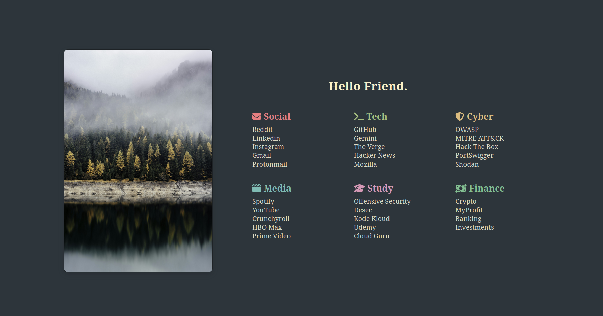

# ThemesFirefox

A minimalistic and customizable startpage for your browser.

## Preview

> **Note:** The image above is for illustration purposes. Replace it with a real screenshot of your project.

## Project Structure

- `index.html` — Main page
- `style.css` — Custom styles
- `images/` — Images used on the page

## How to use

1. Download or clone this repository.
2. Open the `index.html` file in your browser.
3. Customize the links, images, and styles as you wish.

## Example usage

Set the path to the `index.html` file as your browser's homepage for a personalized experience.

---

Made for customization and minimalism enthusiasts.
